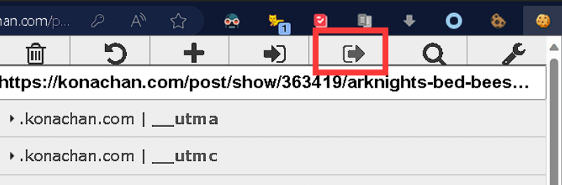
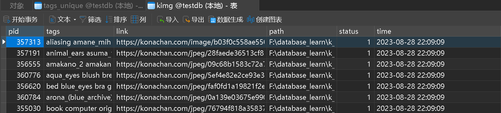
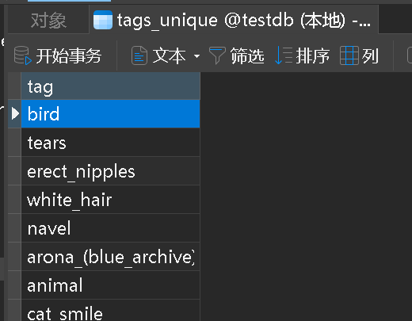
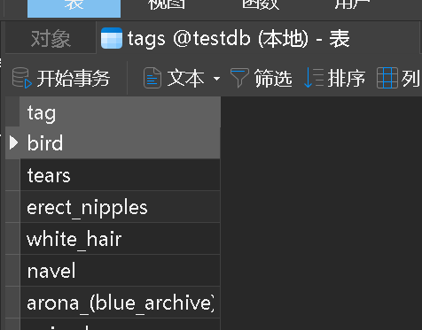

### 使用：

1. 首先使用edge插件[Cookie Editor](https://microsoftedge.microsoft.com/addons/detail/cookie-editor/ajfboaconbpkglpfanbmlfgojgndmhmc)或者其他类似的插件,复制图片详情页cookie到_cookies_.json , 记得及时更新_cookies_.json.  (ps : 不弄也许也行, 但文件内容要清空)

2. 有数据库启动 main.py
3. 如果没有数据库，启动 get_imags_data.py

### 依赖：

查看 packages.txt , requirements.txt

### 配置 .env 文件

|       参数       | 默认  |             示例             |                 说明                 |
| :--------------: | :---: | :--------------------------: | :----------------------------------: |
|     IMG_PATH     |  无   |           ./kimage           |  保存图片的路径, 建议使用绝对路径.   |
|    mysql_user    |  无   |             root             |              数据库用户              |
|  mysql_password  |  无   |            123456            |              数据库密码              |
|    mysql_host    |  无   |          localhost           |            数据库主机地址            |
|  mysql_database  |  无   |            testdb            |                数据库                |
| mysql_img_table  |  无   |             kimg             |          保存图片数据的表名          |
| mysql_tags_table |  无   |             tags             |          保存tag数据的表名           |
|   down_number    |  无   |              2               |             单次下载数量             |
|      times       |  无   |             200              |             单次循环次数             |
|    sem_times     |  无   |              5               |      下载源码和图片的最大并发数      |
|       low        |  无   |            355000            |         下载范围[low,upper]          |
|      upper       |  无   |            361871            |         下载范围[low,upper]          |
|    http_proxy    |  无   |    http://127.0.0.1:10809    | 最好http代理, (socks5代理也可以也许) |
|     pid_list     |       | [343131,344097,344098,35543] |           测试选项无需修改           |
|       mode       |       |            a 或 b            |           测试选项无需修改           |

### **本地数据表位置：**

1. 启动get_imags_data.py 产生:

   ./Data/kimg.csv

   ./Data/tagscsv
2. main.py 产生的:

   ./k_spider/{kimg_table}.csv

   ./k_spider/\{tags_table}.csv

   ./k_spider/tags_unique.csv   <-  这个表是同步数据库的, 前两个不同步

### 表样式:

数据库会产生三个表:

* kimg
* tags
* tags_unique

